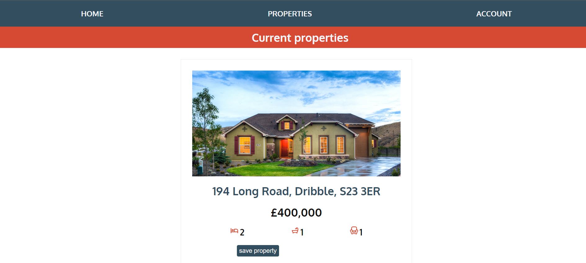
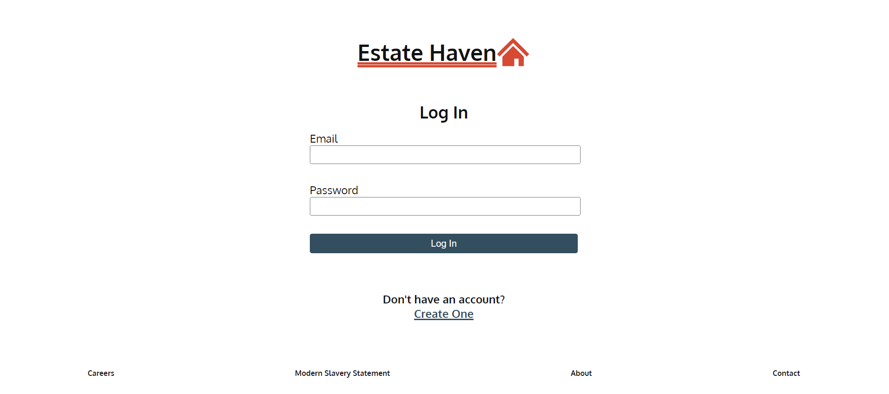

# Estate Haven - an online Property database

<h1><a href="property-tracker-two.vercel.app">Visit Website</a></h1>

## Table of Contents
- [About](#about)
- [Screenshots](#screenshots)
- [Languages](#languages)
- [Code of Note](#code_of_note)
- [Bugs to fix](#bugs_to_fix)

---

## About 

An online database for estate agents to use to keep track of properties. Agents can sign up for an account (or log in to an existing one) and add properties to the database (Firestore) or edit or delete them. Agents can also save other's properties, which stores them in a separate section on their account. This was my first use of useContext, but I felt I learnt a lot about state and persistence, as well as using Firebase more than in other projects. This app uses Firebase Auth, Firestore, and Firebase storage (to deal with uploading images).

---

## Screenshots 

---

## Languages 

- ReactJS (JavaScript)
- SCSS

---

## Code of Note 

- useContext to allow auth and database functions to be used around the app and not rely on prop trailing
- using Firebase Auth, Firestore, and Storage together
- Populating edit forms with data from the database for a smooth user experience
- Deleting an account causes all properties they have saved to become unsaved by them, and all properties they uploaded will be deleted also.

---

## Bugs to fix/Next steps 

- Page for editing account
- Can't refresh on account pages
- Save button only works on second click
- Implement a carousel for property images
- Figure out unit tests with mock context

